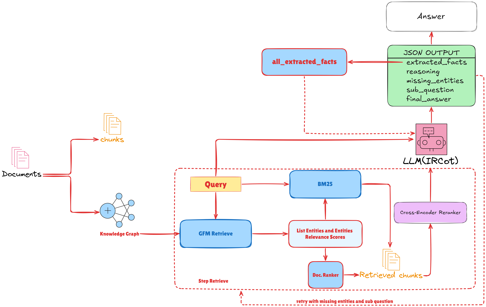
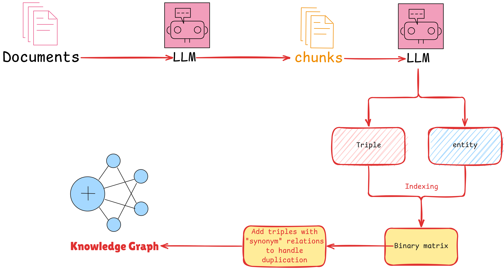

# GFM-Hybrid

**Entity-Score-Guided Hybrid Retrieval with Iterative Chain-of-Thought Reasoning for Multi-Hop and Medical Question Answering**

Đây là **gói mã nguồn (`gfmrag_hybrid`)** của GFM-Hybrid — một pipeline **truy hồi + suy
luận hợp nhất** cho hỏi đáp đa bước (multi-hop) và hỏi đáp y tế. Ý tưởng cốt lõi:
một **Graph Foundation Model (GFM-RAG)** khi suy luận trên đồ thị tri thức sinh ra
một **tensor độ liên quan thực thể** $P_q \in [0,1]^{|\mathcal{V}|}$ — thay vì vứt
bỏ tensor này, GFM-Hybrid **giữ lại và dùng nó để lái một bộ tìm kiếm BM25** theo
thực thể. Bằng chứng từ nhánh đồ thị và nhánh từ vựng được gộp vào một **pool làm
mới mỗi bước**, một **cross-encoder** xếp hạng tinh, và vòng lặp **IRCoT** với đầu
ra JSON có cấu trúc điều phối toàn bộ qua nhiều bước.

> Đồ thị cung cấp **độ rộng cấu trúc**, còn nhánh từ vựng theo thực thể khôi phục
> **chi tiết bề mặt** mà đồ thị (không đầy đủ) bỏ sót — quan trọng cho y tế và ngôn
> ngữ ít tài nguyên như tiếng Việt.

## Kết quả chính (so với baseline mạnh nhất)

| Dataset | Recall@2 | Recall@5 | EM / F1 | LLM-Judge |
|---|---|---|---|---|
| HotpotQA (EN, 2-hop) | **86.75** | **95.65** | **66.10 / 79.57** | — |
| MuSiQue (EN, 2–4 hop) | **56.32** | **74.88** | **41.90 / 52.46** | — |
| PubMedQA (EN, y tế) | **65.79** | **86.76** | — | **401/1000** |
| Vietnamese Medical (y tế) | **98.50** | **98.79** | — | **886/1000** |

---

## 1. Kiến trúc tổng quan



Vòng lặp xen kẽ chạy tối đa `max_steps` bước, duy trì **bốn bộ nhớ toàn cục**:
**global chunk pool** (xóa sạch đầu mỗi bước), **cumulative facts** (ngữ cảnh dài
hạn), **all-discovered-entities** (tránh truy vấn lặp), **previous sub-questions**.
Mỗi bước gồm pha truy hồi (đồ thị + BM25 theo thực thể) và pha suy luận IRCoT.

### Bốn thành phần

1. **Graph-Foundation Retriever with Entity Scores** — trả về *cả* tài liệu xếp
   hạng *và* tensor $\tilde{P}_q$ (chuẩn hóa min–max); chunk chấm bằng RRF ($k=60$).
   → `gfmrag_hybrid/gfm/retriever_with_entity_scores.py`
2. **Entity-Augmented BM25 Retrieval** — ghép seed entities + thực thể đồ thị điểm
   cao ($\tilde{P}_q \ge \theta=0.10$) + sub-question thành **một** câu BM25.
   → `gfmrag_hybrid/workflow/core_engine.py` (`BM25Searcher`)
3. **Step-Local Global Chunk Pool** — gộp hai nhánh, giữ riêng điểm, **làm mới mỗi
   bước**. → `core_engine.py`
4. **Cross-Encoder Reranking + IRCoT** — `BAAI/bge-reranker-v2-m3` (max-pooling) +
   LLM sinh JSON 5 trường (`reasoning`, `extracted_facts`, `missing_entities`,
   `sub_question`, `final_answer`). → `core_engine.py` (`agent_reasoning_with_reranker`)


## 2. Xây dựng đồ thị tri thức (offline)



Tách chunk (LLM/SemanticChunker) → NER + trích triple → ma trận thực thể–tài liệu →
thêm quan hệ đồng nghĩa. Trong repo, bước offline gồm **Stage 0** (splitter, đa ngôn
ngữ vi/en) và **Stage 1** (tùy chọn gom cụm chunk + xây KG) — xem
`gfmrag_hybrid/workflow/stage0_split_documents.py` và `gfmrag_hybrid/kg_construction/chunk_grouper.py`.

---

## 3. Cấu trúc gói `gfmrag_hybrid`

```
gfmrag_hybrid/
├── gfm/
│   └── retriever_with_entity_scores.py        # Component 1 (GFM + entity scores)
├── chunkers/document_chunker.py               # SemanticChunker (tách chunk)
├── kg_construction/chunk_grouper.py           # Gom cụm chunk (stage1)
├── utils/text_tokenize.py                     # Tách từ vi/en
└── workflow/
    ├── stage0_split_documents.py              # Splitter
    ├── stage1_index_dataset.py                # Xây KG-index
    ├── stage2_kg_pretrain.py / stage2_qa_finetune.py
    ├── stage3_qa_ircot_inference_*.py         # Suy luận IRCoT
    ├── core_engine.py                         # Components 2–4 (BM25 + pool + rerank + IRCoT)
    ├── app.py                                 # Chatbot (Streamlit)
    └── config/                                # Cấu hình Hydra
data/<data_name>/{raw, processed}              # Bộ dữ liệu
gfm_model/                                     # Checkpoint GFM
model_cache/                                   # Cache embedding
```

---

## 4. Yêu cầu hệ thống

| Thành phần | Yêu cầu |
|---|---|
| Python | **3.12** (>=3.12, <3.13) |
| GPU | NVIDIA + **CUDA 12.x** (bắt buộc cho GFM/GNN) |
| LLM API | Khóa OpenAI (endpoint tương thích, vd Yescale) |

Mô hình mặc định (bài báo): LLM `GPT-4o-mini`, cross-encoder
`BAAI/bge-reranker-v2-m3`, embedding `Multilingual-E5` (cấu hình repo dùng
`dangvantuan/vietnamese-embedding` cho tiếng Việt).

## 5. Cài đặt

```bash
conda create -n gfmhybrid python=3.12 && conda activate gfmhybrid
conda install cuda-toolkit -c nvidia/label/cuda-12.4.1
pip install torch torchvision torchaudio --index-url https://download.pytorch.org/whl/cu121
pip install -r requirements.txt
pip install -e .            # cài gói gfmrag_hybrid (editable)
```

Tạo `.env` trong `gfm-rag/` (KHÔNG commit):

```dotenv
OPENAI_API_KEY=sk-...
HF_TOKEN=hf_...
```

## 6. Dữ liệu

**Link data:** [Google Drive](https://drive.google.com/file/d/1ILAAFH2UpWpyD9WC1A2eFbjddus2eQ0V/view?usp=drive_link)

Đặt dữ liệu thô tại `data/<data_name>/raw/`:
- `dataset_corpus.json` — `{ "tên_tài_liệu": "nội dung..." }`
- `train.json` / `test.json` (tuỳ chọn) — `id`, `question`, `answer`, `supporting_facts`

| Dataset | Lĩnh vực | Ngôn ngữ | Suy luận | Nguồn |
|---|---|---|---|---|
| HotpotQA | Tổng quát | EN | 2-hop | Wikipedia |
| MuSiQue | Tổng quát | EN | 2–4 hop | Wikipedia |
| PubMedQA | Y tế | EN | Multi-hop | Abstract PubMed |
| Vietnamese Medical | Y tế | VI | Multi-hop | Hướng dẫn điều trị / dược thư |

## 7. Sử dụng

```bash
# Stage 0 — tách document -> chunk (đa ngôn ngữ vi/en)
python -m gfmrag_hybrid.workflow.stage0_split_documents \
    dataset.data_name=vietnamese_medical language=vi

# Stage 1 — xây KG-index (bật gom cụm chunk tùy chọn)
python -m gfmrag_hybrid.workflow.stage1_index_dataset \
    dataset.data_name=vietnamese_medical language=vi \
    chunk_grouping.enabled=true chunk_grouping.granularity=chunk

# Stage 2 — (tùy chọn) pre-train / fine-tune GFM
python -m gfmrag_hybrid.workflow.stage2_kg_pretrain
python -m gfmrag_hybrid.workflow.stage2_qa_finetune

# Stage 3 — suy luận IRCoT (GFM-Hybrid)
python -m gfmrag_hybrid.workflow.stage3_qa_ircot_inference_chunks_vietnamese_medical \
    dataset.data_name=vietnamese_medical test.max_steps=3 test.top_k=5

# Chatbot web
cd gfmrag_hybrid/workflow && streamlit run app.py
```

## 8. Siêu tham số (theo bài báo)

| Tham số | Giá trị | Vai trò |
|---|---|---|
| `top_k` / `top_k_chunks` | 5 / 5 | Tài liệu nhánh đồ thị / chunk vào LLM |
| `max_steps` | 3 | Số bước IRCoT tối đa |
| `top_entity_k` | 15 | Thực thể đồ thị điểm cao giữ lại / bước |
| `max_bm25_chunks` / `max_gfm_chunks` | 15 / 20 | Giới hạn chunk mỗi nhánh |
| `doc_ranker.top_k` | 30 | Thực thể tính trọng số xếp hạng tài liệu |
| `k` (RRF) | 60 | Hằng số làm mượt RRF |
| `θ` (entity threshold) | 0.10 | Ngưỡng $\tilde{P}_q$ để thực thể vào câu BM25 |

## 9. Đánh giá (LLM-as-a-Judge)

```bash
export OPENAI_API_KEY="sk-..."
python LLM_as_a_judge.py --input prediction.jsonl --output evaluated.jsonl --workers 5
```
`prediction.jsonl` mỗi dòng: `id`, `question`, `answer` (tham chiếu), `response`.

## 10. Trích dẫn

```bibtex
@article{nguyen2025gfmhybrid,
  title  = {GFM-Hybrid: Entity-Score-Guided Hybrid Retrieval with Iterative
            Chain-of-Thought Reasoning for Multi-Hop and Medical Question Answering},
  author = {Nguyen, Minh Hung and Le, Van Thanh},
  year   = {2025}
}
```

GFM-Hybrid mở rộng **GFM-RAG** (Luo et al., NeurIPS 2025), lấy cảm hứng từ IRCoT,
HippoRAG, GraphRAG, LightRAG cùng họ reranker/embedding BGE.
